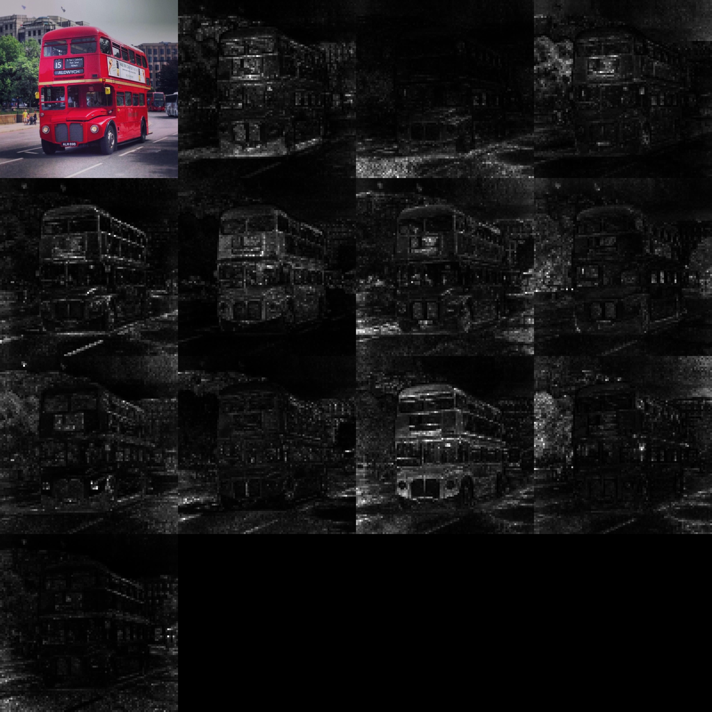
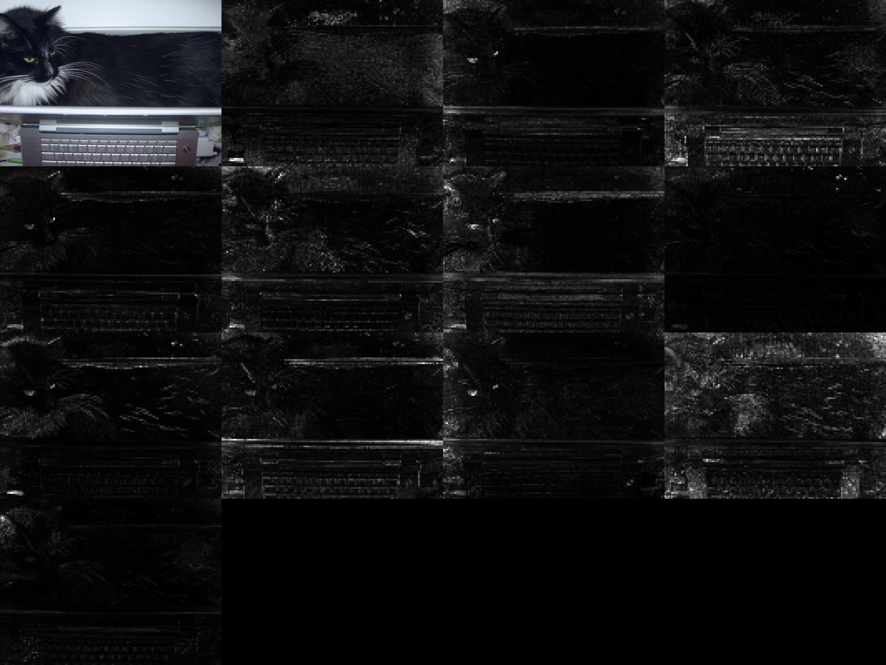
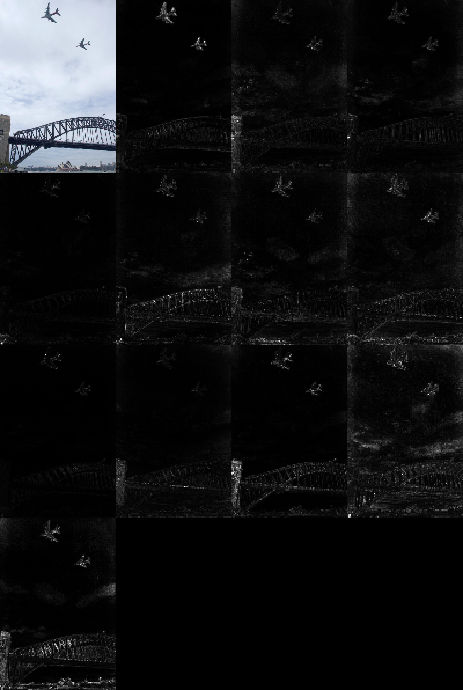
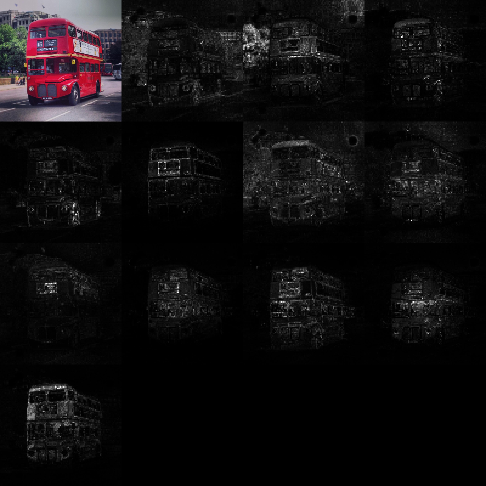
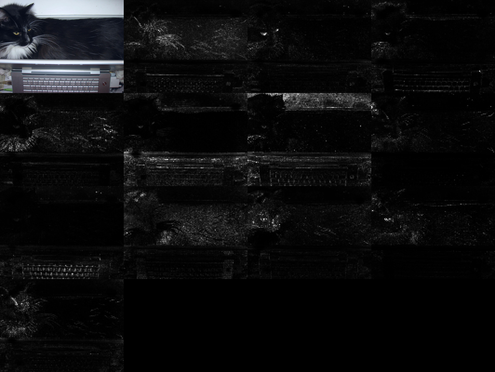
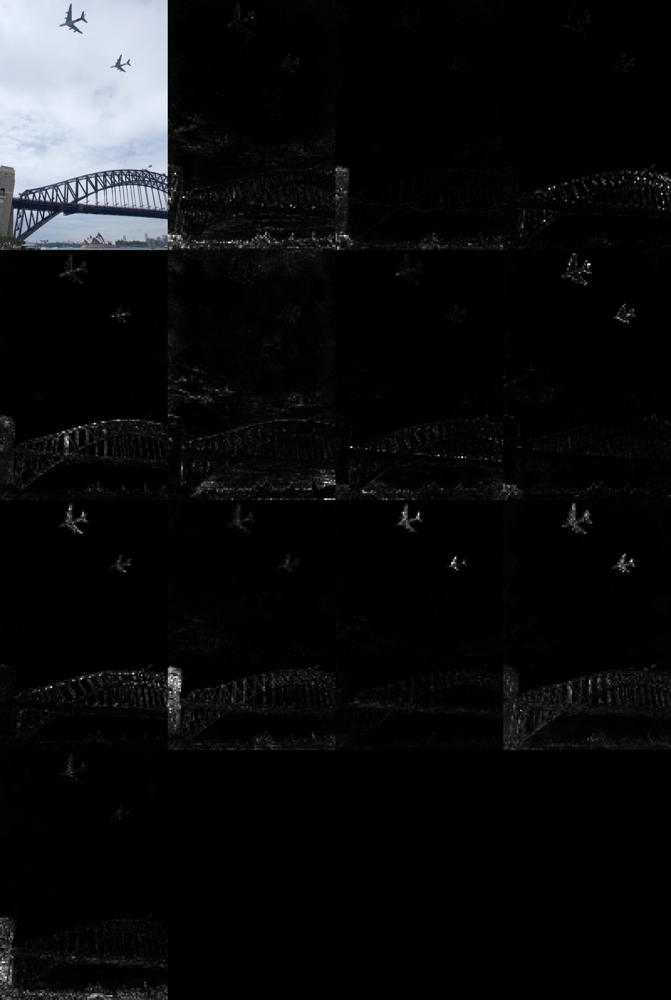

## Wilde beasts of silicon

> *... come ye, assemble all the beasts of the field ...* &ndash; Jeremiah 12:9

This is a stand-alone repository to facilitate the use of all models I have trained on SAYCam (and more!). It is still in progress. More models and further functionalities will be forthcoming shortly. The models are all hosted on [Huggingface](https://huggingface.co/eminorhan), which, to my not inconsiderable astonishment, seems to offer free unlimited storage for models and datasets (thanks Huggingface!).

### Image embedding models

#### Loading the models
Model names are specified in the format `x_y_z`, where `x` is the self-supervised learning (SSL) algorithm used to train the model, `y` is the data used for training the model, and `z` is the model architecture:

* `x` can be one of `dino`, `mugs`, or `mae`
* `y` can be one of `say`, `s`, `a`, `y`, `imagenet100`, `imagenet10`, `imagenet3`, or `imagenet1`
* `z` can be one of `resnext50`, `vitb14`, `vitl16`, `vitb16`, `vits16` 

Please note that not all possible combinations are available at this time (see [here](https://huggingface.co/eminorhan) for a list of all available models). You will get an error if you try to load an unavailable model. 

Loading a pretrained model is then as easy as:

```python
from utils import load_model

model = load_model('dino_say_vitb14')
```

This will download the corresponding pretrained checkpoint, store it in cache, build the right model architecture, and load the pretrained weights onto the model, all in one go! When you load a model, you will get a warning message that says something like `_IncompatibleKeys(missing_keys=[], unexpected_keys=...)`. That's OK, don't panic! Life is like that sometimes. This is because we're not loading the projection head used during DINO or Mugs pretraining, or the decoder model used during MAE pretraining. We're only interested in the encoder backbone.

#### Visualizing the attention heads
I also include here some bare bones functionality to visualize the attention heads of the transformer models. All you need to do is something along the lines of:
```python
import torch
from utils load_model, preprocess_image, visualize_attentions

model = load_model('dino_say_vitb14')

img = preprocess_image(img_path="imgs/img_0.jpg", img_size=1400)
with torch.no_grad():
    visualize_attentions(model, img, patch_size=14)
```
The file [`test.py`](https://github.com/eminorhan/silicon-menagerie/blob/master/test.py) contains a more fleshed out usage example. This will produce images like the following (with the original image on the top left in each case).

* **`dino_say_vitb14`:**




* **`dino_imagenet100_vitb14`:**




### What you need
* A reasonably recent version of PyTorch and torchvision (I have `pytorch==1.10.2` and `torchvision==0.11.3`). 
* You do not need a GPU to load and use the models. 
* If you're only doing inference and you're not feeding the model very large batches of input, you should be able to easily fit even the largest models here (ViT-L/16) on a single V100 GPU with 32GB memory.
* The `huggingface_hub` library to download the models from the Huggingface Hub (I have `huggingface-hub==0.10.0`).
* To use the MAE models, you will need the `timm` library (I have `timm=0.3.2`).
* For the attention visualizations, you will also need the PIL library (I have `pillow==8.4.0`).

### Generative image models

These are generative models that can be used to generate images. For these models, we first learn a discrete codebook of size 8192 with a [VQ-GAN](https://github.com/CompVis/taming-transformers) model and then encode the video frames as 32x32 integers from this codebook. These discretized and spatially downsampled frames are then fed into a GPT model to learn a prior over the frames. The two parts of the model are shared separately below. The `encoder-decoder` part can be used to encode images with the discrete codebook, as well as decode images (to 256x256 pixels) given a discrete latent representation. The `GPT` part can be used to generate (or sample) new discrete latent representations.

**TBD**

### Generative video models

**TBD**
